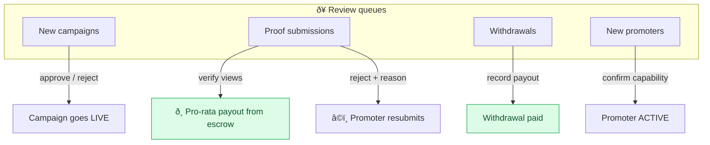

<div align="center">

# 🛡️ Ralia Admin

### The operations console — the human quality gate between promoters and clients.

<br/>


</div>

---

Everything a client sees passes through here first. Admins approve campaigns, **verify proof**,
run payouts, manage promoter capabilities, and reconcile the ledger. Money- and score-affecting
actions are gated by capability (RBAC) and every one writes an audit row.

## 🔎 What flows across the desk



## 🧾 Proof review

```mermaid
sequenceDiagram
    participant P as Promoter
    participant Q as Review queue
    participant Adm as Admin
    participant L as Ledger
    participant C as Client

    P->>Q: Submit proof (Day X of N)
    Adm->>Q: Open card · verify view count
    alt meets threshold
      Adm->>L: Approve → pay pro-rata (per slot)
      L->>C: Surface as "verified delivery"
    else below threshold
      Adm->>P: Reject with reason → resubmit
    end
```



- **Campaign Submissions tab** is now full history — an *Awaiting review* lane and a *Reviewed*
  lane, so approved/rejected proof stays visible (with verdict, amount paid, and reason) instead of
  vanishing from the queue.
- Proof screenshots render straight from the API's file route (`/v1/files/:id`).

## 🔐 Capabilities (RBAC)

| Capability | Guards |
|---|---|
| `REVIEW_EVIDENCE` | approving campaigns, reviewing proof, verifying channels |
| `RECORD_MONEY` | funding campaigns, paying withdrawals, editing platform rules |

## 🚀 Quickstart

```bash
npm install
cp .env.example .env     # set API_ORIGIN (defaults to http://localhost:6100)
npm run dev              # http://localhost:6200
```

Seeded login: `admin@ralia.test` · password `Password123!`

<details>
<summary><b>🔐 Environment</b></summary>

| Variable | Purpose |
|---|---|
| `API_ORIGIN` | The API origin the Next server proxies `/v1` + `/r` to |
| `NODE_ENV` | `production` in deploys |
</details>

<details>
<summary><b>🛠️ Scripts</b></summary>

| Script | Does |
|---|---|
| `dev` | dev server on :6200 |
| `build` | production build |
| `start:prod` | `node server.js` (only for a self-hosted Node host; Vercel builds natively) |
| `typecheck` | `tsc --noEmit` |
</details>

## 🚢 Deployment

Deploys to **Vercel** (native Next.js) — import the repo, set `API_ORIGIN` + `NEXT_PUBLIC_APP_ENV`, and Vercel builds each push. See `DEPLOY.md`.

---

<div align="center">
<sub>Part of Ralia · <a href="../ralia-api">API</a> · <a href="../ralia-client">Client</a> · <a href="../ralia-promoter">Promoter</a></sub>
</div>
